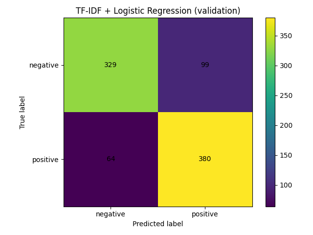
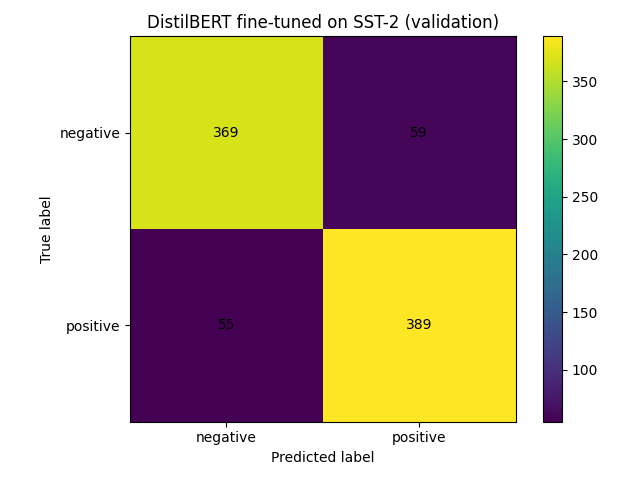

# SST-2 Sentiment Classification

This project compares two approaches on the SST-2 dataset:
- **TF-IDF + Logistic Regression**
- **DistilBERT Fine-Tuning**

DistilBERT achieves higher accuracy and F1-score, demonstrating the benefits of pretrained transformer models.

## Results

| Model                         | Accuracy | F1-Score |
|-------------------------------|----------|----------|
| TF-IDF + Logistic Regression  | 0.8131   | 0.8234   |
| DistilBERT (fine-tuned)       | 0.8722   | 0.8693   |

## Confusion Matrices

TF-IDF:

DistilBERT:

## How to Run

TF-IDF baseline:
python src/baseline_tfidf.py

DistilBERT fine-tuning：
python src/train_transformer.py

## Files

src/ — training & evaluation code

reports/figures/ — confusion matrices

requirements.txt — dependencies
